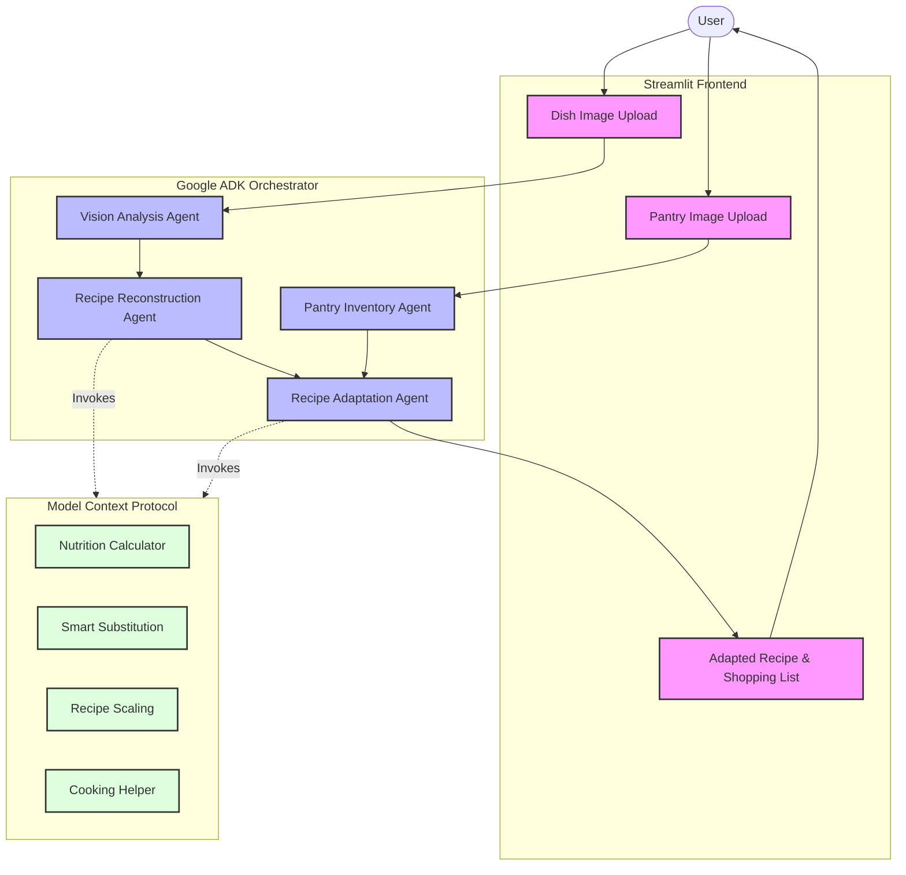
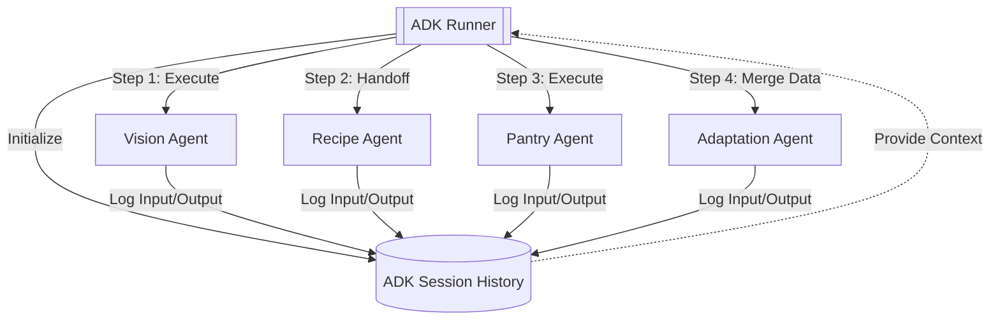
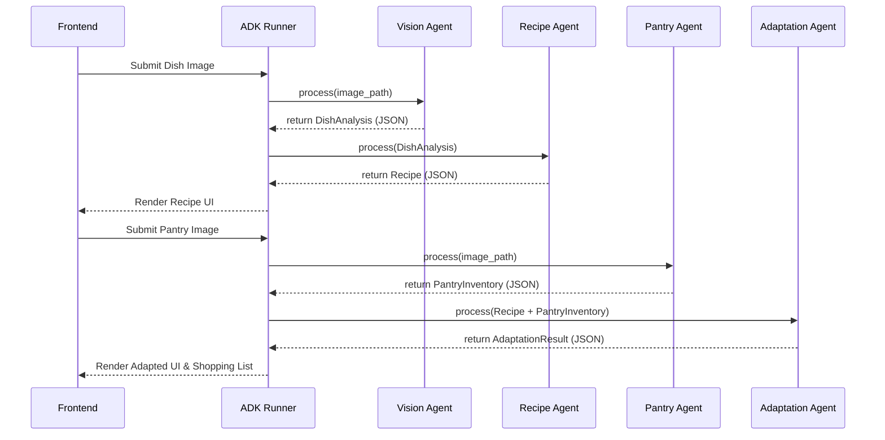
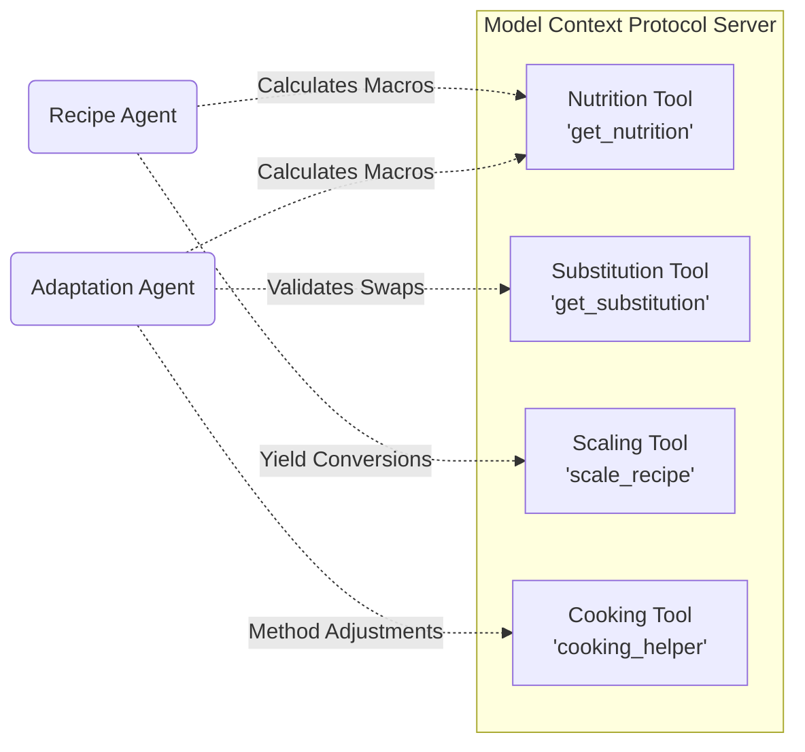
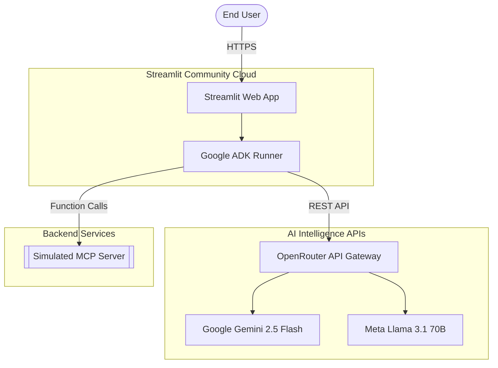
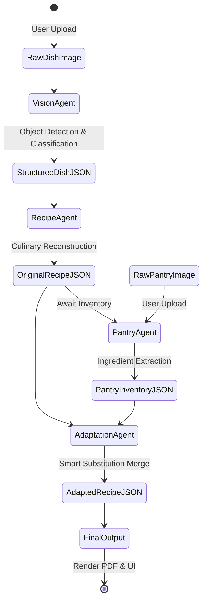

# Snap2Cook AI Architecture

This document contains detailed architectural diagrams for the Snap2Cook AI project, demonstrating the complete end-to-end multi-agent workflow, ADK orchestration, Model Context Protocol (MCP) interactions, and overall data flow.

## 1. Overall System Architecture

---

## 2. Google ADK Workflow

---

## 3. Agent Communication Diagram

---

## 4. MCP Interaction Diagram

---

## 5. Deployment Diagram

---

## 6. Data Flow Diagram

